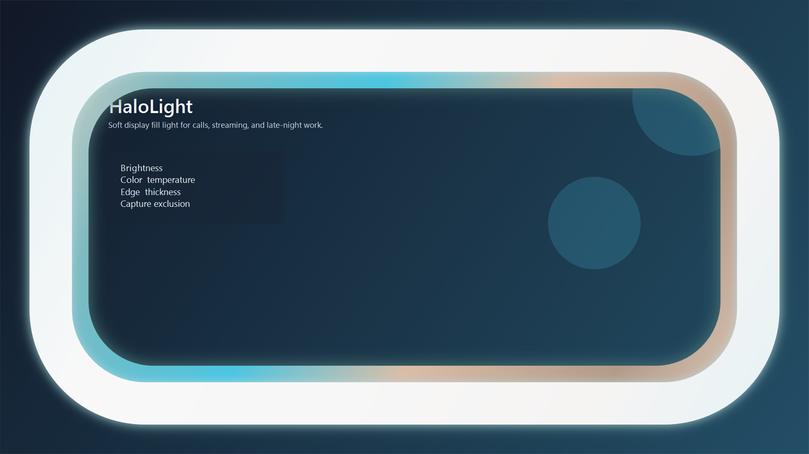

# HaloLight

HaloLight is a Windows desktop app that turns the edges of your display into a soft fill light for video calls. It uses a transparent overlay so you can brighten your face without giving up normal desktop interaction.

## Screenshots

<p align="center">
  
</p>

## What it does

- Adds a soft light around the selected monitor
- Lets you adjust brightness, color temperature, and edge thickness
- Supports multi-monitor setups
- Runs from the system tray with a global `Ctrl+Shift+L` toggle
- Can launch at startup
- Can optionally exclude the overlay from screen capture
- Saves settings locally between launches

## Tech stack

- C#
- .NET 8
- WPF

## Requirements

- Windows 10 or Windows 11
- .NET 8 SDK for local development
- `.NET 8 Desktop Runtime x64` only if you plan to use the framework-dependent package
- Inno Setup 6 if you want to build the installer locally

## Use

1. Launch HaloLight.
2. Pick the monitor you want to light.
3. Adjust brightness, color temperature, edge thickness, and accent color.
4. Use the tray icon or `Ctrl+Shift+L` to toggle the overlay on and off.
5. Optionally enable launch at startup or capture exclusion from the settings window.

## Build and run

Run the app in development:

```powershell
dotnet run --project .\src\HaloLight\HaloLight.csproj
```

Build a release binary:

```powershell
dotnet build .\HaloLight.sln -c Release
```

Create a framework-dependent publish folder:

```powershell
powershell -ExecutionPolicy Bypass -File .\scripts\publish-local.ps1
```

Create a self-contained publish folder:

```powershell
powershell -ExecutionPolicy Bypass -File .\scripts\publish-local.ps1 -SelfContained
```

Create the recommended Windows installer (`setup.exe`):

```powershell
powershell -ExecutionPolicy Bypass -File .\scripts\build-installer.ps1
```

Build outputs land under `artifacts\`.

## CI builds

GitHub Actions runs `.github/workflows/build-windows-release.yml` on pull requests targeting `main`, on pushes to `main`, and on manual dispatch. Each run builds a self-contained Windows publish and the recommended Inno Setup installer, then uploads the `setup.exe` artifact.

On pull requests it works as a build check only. On pushes to `main` it also creates or reuses a `vX.Y.Z` tag and publishes a GitHub Release automatically. If no release tags exist yet, it starts from the version in `src\HaloLight\HaloLight.csproj`. After that it bumps the patch version on each new push, unless the project version is manually moved ahead to start a new minor or major line.

## Local settings

HaloLight stores settings in `%LOCALAPPDATA%\HaloLight\settings.json`.

## License

MIT. See `LICENSE`.
